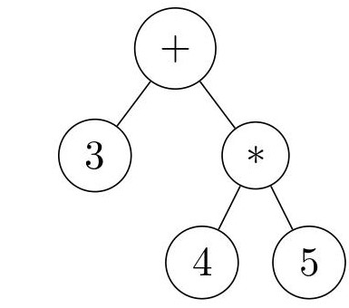

<!-- PROJECT LOGO -->
 

  

<h3 align="center">C++ Expression Tree Template Library</h3>

  

    This is an Expression Tree Template Library made in C++ with classes and a parser to support an explicitly instantiated Expression Tree Template. The parser allows taking a function as input from the user and converting it into an Expression Tree instance, giving a highly time optimized evaluatable expression tree that is executable in C++ code. Methods are also designed to impliment and assist in other expression tree related projects like symbollic regression.
  

<!-- TABLE OF CONTENTS -->
## Table of Contents
<ol>
  <li><a href="#getting-started">Getting Started</a></li>
  <li><a href="#usage">Usage</a></li>
  <li><a href="#roadmap">Roadmap</a></li>
  <li><a href="#license">License</a></li>
  <li><a href="#contact">Contact</a></li>
</ol>

<!-- GETTING STARTED -->
## Getting Started

Download the latest build of the library under releases (will be there in the future). Or follow the directions below to build the library yourself.

### Building The Library

Make sure you have the proper prequisits installed on your machine.
* g++ or another c++ compiler to build the code
* make to run the various Makefiles

(<a href="#top">back to top</a>)

<!-- USAGE EXAMPLES -->
## Usage

Once implimented, it will give examples on use cases for the expresison tree template, along with instructions of how to modify the parser and explicitly instantate expression trees with differeing underlying types.

(<a href="#top">back to top</a>)

<!-- ROADMAP -->
## Roadmap
- [ ] Impliment the Lex / Yacc parser.
- [ ] Impliment the Dictionary Template (Combination of Symbol Table and Array Template).
- [ ] Impliment the Actual Expression Tree Template.
  - [ ] Add methods like assing values to variables and evaluating the Expression Tree.
  - [ ] Allow expression trees to reference and evaluate other expression trees.
  - [ ] Allow the defining of functions for each expression tree template type.
- [ ] Add the non-necessary but time complexity improving AVL Tree specific operations to sym_table class
  - [ ] Add 4 Rotation Operations into insert method
  - [ ] Complete actual removal operation
- [ ] Clean up the repository.
  - [ ] Beautify the README.
  - [ ] Add more verbose documentation to source code.
  - [ ] Add usage examples (how to instantate new template type, use and modify the parser, etc)
- [ ] Add optional Expression Tree Improvements
  - [ ] Helper methods for Symbolic Regression.
  - [ ] Non parser related methods for intializing Expression Tree's (Series, Products, etc).
  - [ ] Methods to allow user to manually  modify expression trees.
- [ ] Various Simplification Techniques.
  - [ ] Removing redundant vertices in Expr Trees (Identities, adding by zero, mutlplying by one, inverse function applications).
  - [ ] Apply distributive property to decrease multiplication counts.
  - [ ] Apply hyperoperations (x + x turns into 2x), (x*x*x turns into x^3).
  - [ ] Evaluating / Simplifying Trig identities
  - [ ] Factoring Polynomials.
  - [ ] Find repeated sub trees in a givenExpression Tree, and evaluating them one time, saving the results, and plugging it in at each location of the sub tree in the parent expression tree.

(<a href="#top">back to top</a>)

<!-- LICENSE -->
## License

Distributed under the GNU General Public License v3.0. See `LICENSE.txt` for more information.

(<a href="#top">back to top</a>)

<!-- CONTACT -->
## Contact

Rodney McCoy - [rbmj2001@outlook.com](rbmj2001@outlook.com) - [Github Profile](https://github.com/RodneyMcCoy)

(<a href="#top">back to top</a>)

